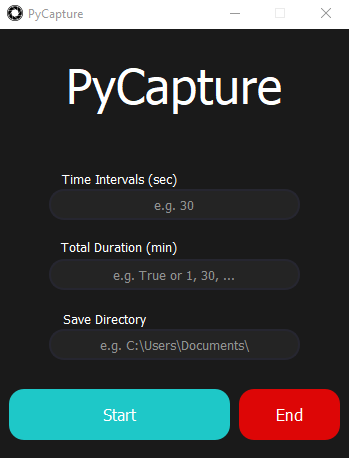

# PyCapture

PyCapture is a desktop application designed to automate screen capturing, allowing users to schedule screenshots at specified intervals. It is ideal for monitoring, documentation, and visual data collection, all without manual intervention.

## Features

- Automatically captures screenshots at user defined intervals.
- Set a total duration for capturing, ranging from a few minutes to continuous monitoring.
- Choose a save directory where all screenshots will be stored for easy access.
- Enjoy a clean, minimalist interface that is intuitive and user-friendly.

## Interface



## Installation and Setup

To get started quickly, download the `PyCapture.exe` file and run it without needing to install or configure anything. For developers, follow these steps to set up the application:

1. **Clone the Repository**

    ```bash
    git clone git@github.com:abdullahashfaq-ds/PyCapture.git
    cd PyCapture
    ```

2. **Create and Activate a Virtual Environment**

    For Linux/Mac:

    ```bash
    python -m venv venv
    source venv/bin/activate
    ```

    For Windows:

    ```bash
    python -m venv venv
    venv\Scripts\activate
    ```

3. **Install Dependencies**

    ```bash
    pip install -r requirements.txt
    ```

4. **Run the Application**

    ```bash
    python app.py
    ```

## License

This project is licensed under the [MIT License](LICENSE). See the LICENSE file for more details.
